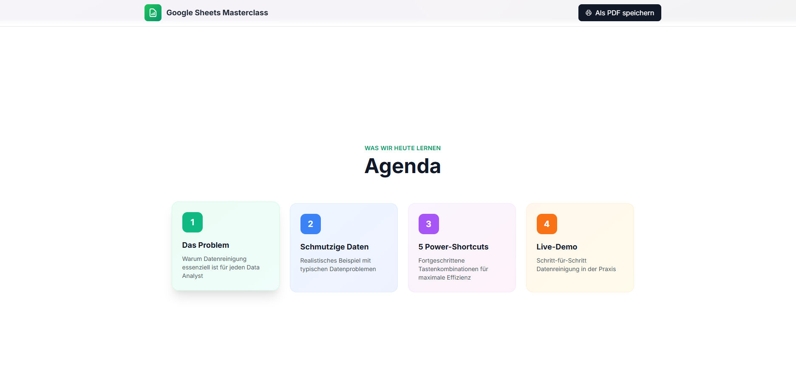
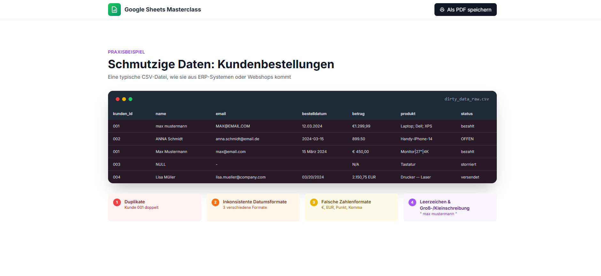

# Google Sheets Datenreinigung Masterclass

**Projekt von Angelika Grzybowska**

Das ist mein Projekt, in dem ich zeige, wie man schmutzige Daten in Google Sheets richtig aufräumt.

---

## Worum geht es?

Bei Data Analytics verbringt man echt viel Zeit damit, Daten erstmal sauber zu machen. Ich habe oft gesehen, wie chaotisch Daten aussehen, die aus Systemen kommen. Duplikate, falsche Datumsformate, komische Währungen, Leerzeichen überall. 

Deshalb habe ich diese Präsentation gemacht. Sie zeigt die wichtigsten Tricks und Shortcuts, mit denen man viel schneller arbeitet.

## Was ist drin?

- Ein realistisches Beispiel mit richtig dreckigen Kundendaten
- Die 5 wichtigsten Power-Shortcuts, die ich selber nutze
- Erklärung von ARRAYFORMULA (das hat mir echt die Augen geöffnet)
- Text zu Spalten aufteilen
- Find & Replace mit Regex
- Remove Duplicates
- Kompletter Workflow von Chaos bis sauberen Daten

## Technik

- Google Sheets
- Fortgeschrittene Formeln
- Arrayformeln
- Reguläre Ausdrücke
- Viele Tastenkombinationen

## So kannst du es anschauen

Die fertige Präsentation findest du hier:  
**https://datenreinigung.netlify.app**

Oder du kannst einfach die index.html öffnen.

## Screenshots

  

## Was ich gelernt habe

Durch dieses Projekt habe ich verstanden, wie wichtig gute Datenqualität ist und wie viel Zeit man sparen kann, wenn man die richtigen Tricks kennt. Vorher habe ich immer alles per Hand gemacht. Jetzt geht vieles automatisch oder mit zwei Klicks.

Ich hoffe das Projekt hilft anderen Studenten oder Leuten, die öfter mit Excel/Google Sheets arbeiten müssen.

---

Angelika Grzybowska  
Mai 2026
